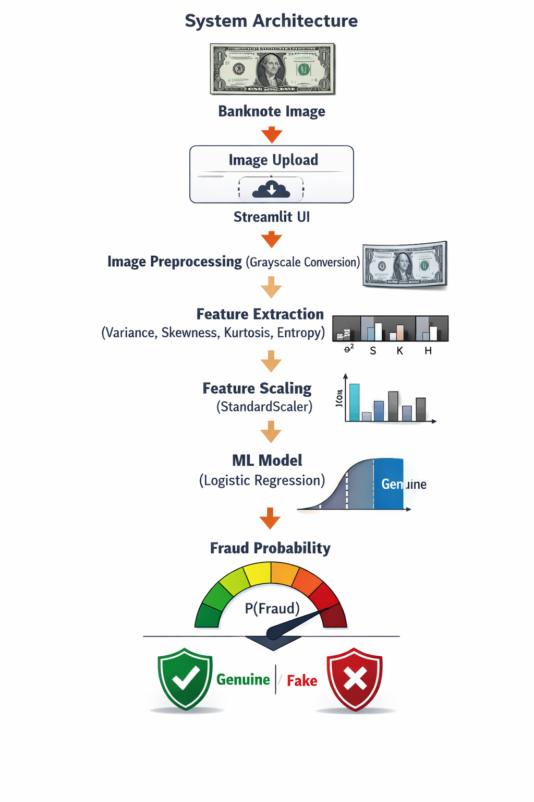

# Banknote Authentication Scanner – ML System Design

## Overview
This project implements a banknote authentication scanner that detects whether a currency note is Genuine or Fake using machine learning.  
The system simulates a real-world banknote scanner by accepting an image input, extracting statistical features, and performing real-time inference through a deployed web application.

---

## System Architecture

  

---

## Data Ingestion
- Input is a banknote image uploaded by the user via Streamlit UI  
- Images are processed in real time using OpenCV  

---

## Feature Engineering
Statistical features are extracted from the grayscale image:
- Variance – measures texture variation  
- Skewness – captures distribution asymmetry  
- Kurtosis – identifies sharpness of peaks  
- Entropy – measures randomness in pixel intensity  

These features are widely used in traditional banknote authentication systems.

---

## Model Training
- Dataset: Banknote Authentication Dataset  
- Feature scaling using StandardScaler  
- Model: Logistic Regression (chosen for interpretability and stability)  
- Threshold tuning applied to improve fraud detection reliability  
- Trained model and scaler persisted as `.pkl` files for reuse  

---

## Inference Flow
1. User uploads a banknote image  
2. Image is converted to grayscale  
3. Statistical features are extracted  
4. Features are scaled using the trained scaler  
5. ML model predicts fraud probability  
6. Threshold-based decision is displayed as Genuine or Fake  

---

## Deployment
- Application built using Streamlit  
- Deployed on Streamlit Cloud  
- Supports real-time image-based fraud detection  

### Live Project Link
Streamlit App:  
https://gjvnxpbfauwzwafbx8grck.streamlit.app/

---

## Monitoring and Retraining Strategy
- Monitor incoming feature distributions from uploaded images  
- Track prediction confidence and misclassification patterns  
- Retrain the model periodically or when data drift is detected  

---

## Technologies Used
- Python  
- Streamlit  
- OpenCV  
- Scikit-learn  
- NumPy  
- SciPy  
- Joblib  

---

## Conclusion
This project demonstrates a production-style ML system, integrating image preprocessing, feature engineering, model inference, deployment, and monitoring.  
It closely mirrors real-world financial fraud detection scanners, emphasizing reliability, interpretability, and scalability.
